## Arquitetura 802.1X

### Componentes
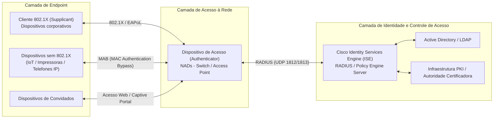

### Estado da porta

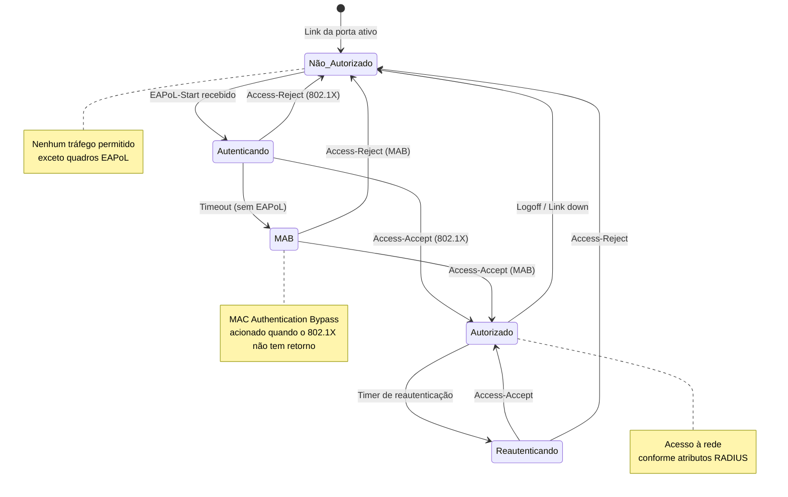

### Escolha do Método de Autenticação

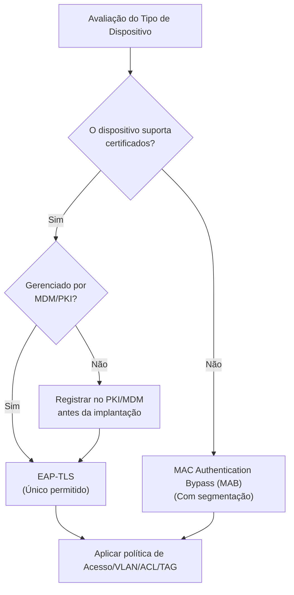

### Autenticação EAP-TLS

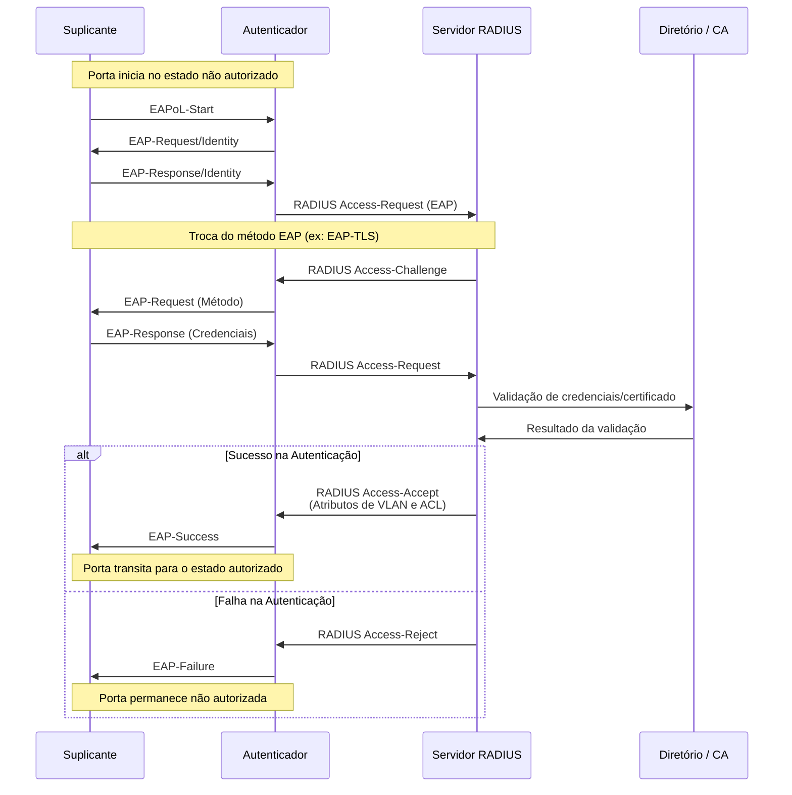

### Autenticação EAP-TEAP

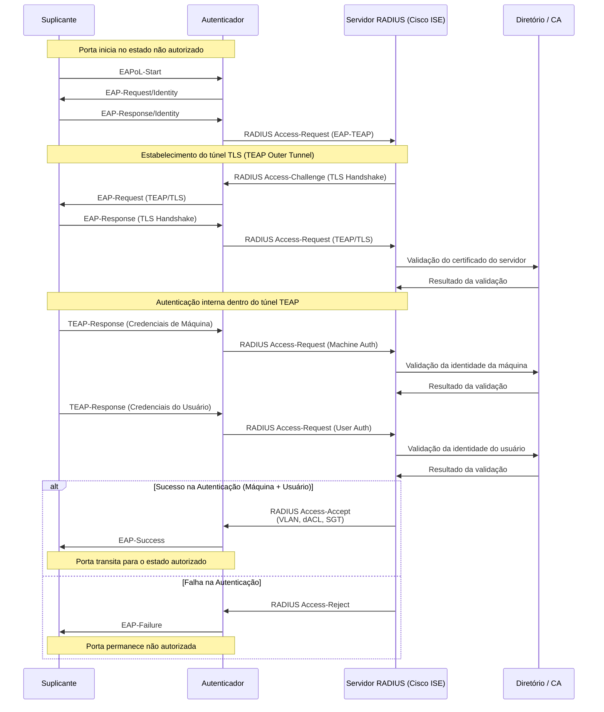

### MAC Authentication Bypass (MAB)

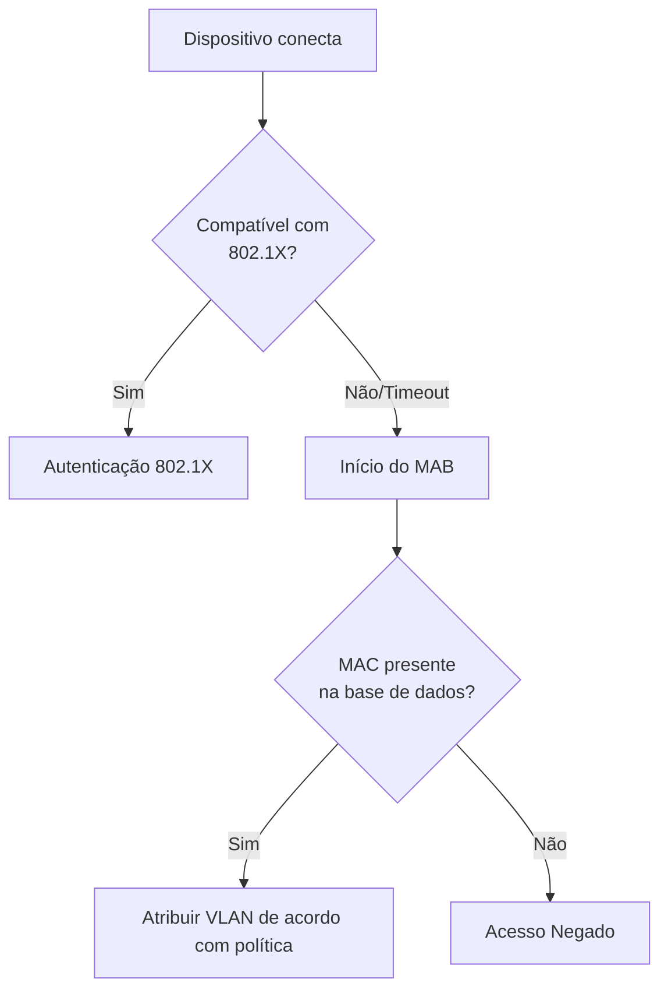

### Autenticação EAP-TEAP + MAB
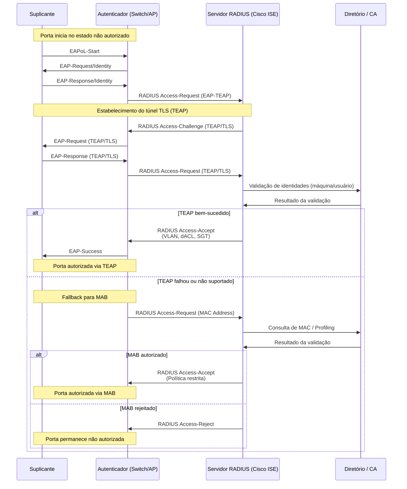

### MAB Configuration Requirements

| Parâmetro                      | Configuração Recomendada                                                        | Justificativa Técnica                                                                          |
| ------------------------------ | ------------------------------------------------------------------------------- | ---------------------------------------------------------------------------------------------- |
| Timeout do MAB                 | Iniciar o MAB após o timeout do 802.1X (≈ 30 segundos)                          | Garantir prioridade ao 802.1X, utilizando MAB apenas como mecanismo de fallback                |
| Formato do endereço MAC        | Padronização em minúsculas (lowercase) e com separador (ex.: xx-xx-xx-xx-xx-xx) | Assegurar consistência no cadastro e na correlação de identidades no ISE                       |
| Atributo RADIUS utilizado      | Calling-Station-Id                                                              | Identificar o dispositivo com base no endereço MAC enviado pelo NAD (switch/AP)                |
| Device Profiling               | Habilitado e obrigatório                                                        | Validar o tipo de dispositivo e reduzir o risco de autenticação indevida baseada apenas no MAC |
| Intervalo de re-profiling      | 24 horas                                                                        | Detectar alterações de perfil e possíveis tentativas de spoofing de MAC                        |
| Política para MAC desconhecido | Bloqueio ou quarentena (VLAN restrita / ACL de contenção)                       | Aplicar o princípio de segurança por padrão (default deny)                                     |

### MAB Use Cases

MAB provides network access for devices that cannot perform 802.1X authentication:

| Device Category | Examples | MAB Policy |
|-----------------|----------|------------|
| Network printers | Enterprise print devices | Registered MAC, printer VLAN |
| Building systems | HVAC, access control, elevators | Registered MAC, IoT VLAN |
| Medical devices | Monitors, diagnostic equipment | Registered MAC, restricted VLAN |
| AV equipment | Displays, projectors | Registered MAC, AV VLAN |
| Legacy systems | Older equipment without supplicant | Registered MAC, legacy VLAN |

## Arquitetura ISE / Redundância

### Redundant Deployment

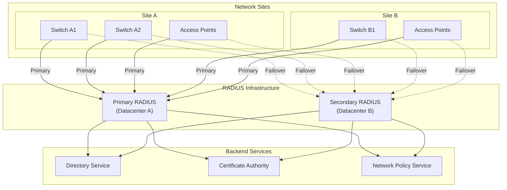

### RADIUS Attributes for Policy Enforcement

| Attribute | Number | Purpose | Example |
|-----------|--------|---------|---------|
| Tunnel-Type | 64 | VLAN assignment | VLAN |
| Tunnel-Medium-Type | 65 | Medium type | IEEE-802 |
| Tunnel-Private-Group-ID | 81 | VLAN ID/name | 20 |
| Filter-Id | 11 | ACL assignment | CORP-ACL |
| Session-Timeout | 27 | Reauth interval | 28800 (8 hours) |
| Termination-Action | 29 | Post-session action | RADIUS-Request |

## Wired 802.1X Implementation

### Switch Port Configuration Standards

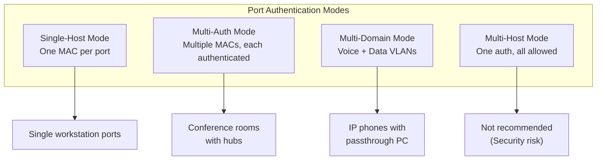

### Port Configuration Requirements

| Setting | Standard Value | Rationale |
|---------|---------------|-----------|
| Authentication mode | Multi-Domain (voice+data) or Multi-Auth | Support IP phones and conferencing |
| Host mode | Multi-auth preferred | Per-device authentication |
| Periodic reauthentication | Enabled, 8 hours | Session validation |
| Quiet period | 60 seconds | Retry delay after failure |
| Tx period | 30 seconds | EAP request interval |
| Supplicant timeout | 30 seconds | Client response timeout |
| Server timeout | 30 seconds | RADIUS response timeout |
| Maximum requests | 3 | Retry attempts |
| Guest VLAN | Enabled for designated ports | Unauthenticated access where required |
| Auth-fail VLAN | Enabled | Quarantine for failed auth |
| Critical VLAN | Enabled | Access when RADIUS unavailable |

### Port Exception Categories

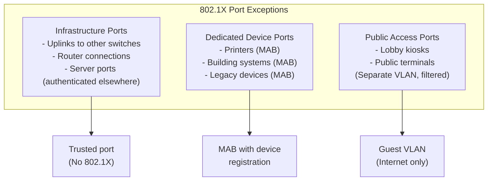

## Wireless 802.1X Integration

### Wireless-Specific Considerations

| Aspect | Wired | Wireless | Implication |
|--------|-------|----------|-------------|
| Physical port | One device per port | Multiple clients per AP | Use multi-auth mode on AP |
| Roaming | N/A | Client moves between APs | Fast BSS transition (802.11r) |
| Key management | EAPoL-Key | 4-way handshake + PMK caching | OKC/802.11r for fast roaming |
| Encryption | Optional (MACsec) | Required (WPA3) | Always encrypt wireless |

### Fast Roaming Support

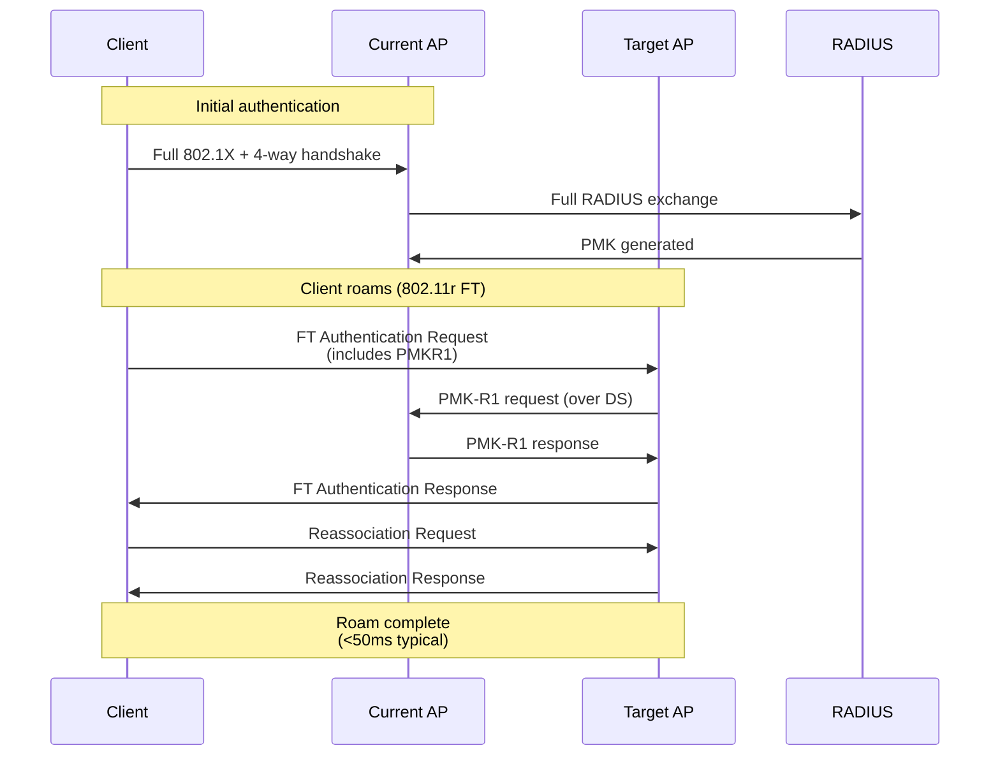

## Security Considerations

### Threat Mitigation

| Threat | Without 802.1X | With 802.1X |
|--------|----------------|-------------|
| Unauthorized device connection | Possible | Blocked at port |
| MAC spoofing | No detection | Limited by profiling |
| Rogue access points | Not controlled | Detected/blocked |
| Lateral movement | Unrestricted | VLAN isolation |
| Credential theft | Network-wide impact | Limited to authorized resources |
| Physical port abuse | Any device connects | Authentication required |

### MACsec Integration (IEEE 802.1AE)

For high-security environments, 802.1X can enable MACsec encryption:

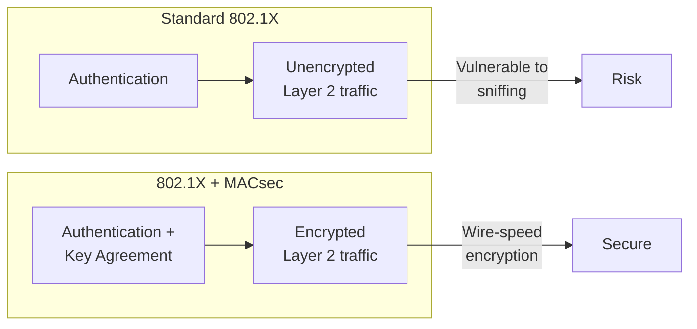

## NIST Alignment

### NIST SP 800-53 Control Mapping

| Control ID | Control Name | 802.1X Implementation |
|------------|--------------|----------------------|
| AC-3 | Access Enforcement | Port-based access control |
| AC-17 | Remote Access | VPN integration with 802.1X |
| AU-2 | Audit Events | RADIUS accounting logs |
| AU-3 | Content of Audit Records | Authentication success/failure details |
| IA-2 | Identification and Authentication | EAP-TLS certificates |
| IA-3 | Device Identification and Authentication | Device certificates, MAB |
| IA-5 | Authenticator Management | Certificate lifecycle |
| IA-8 | Identification and Authentication (Non-Org Users) | Guest VLAN policies |
| SC-8 | Transmission Confidentiality | MACsec option |
| SC-23 | Session Authenticity | EAP session binding |

### NIST SP 800-63B-4 Alignment

| Assurance Level | Authentication Method | 802.1X Equivalent | Status |
|-----------------|----------------------|-------------------|--------|
| AAL1 | Single-factor | Username/password | ❌ **Forbidden** |
| AAL2 | Multi-factor | EAP-TLS with device certificate | ✅ Minimum required |
| AAL3 | Hardware crypto | EAP-TLS with TPM-backed certificate | ✅ Recommended |

> **Policy:** This standard requires AAL2 minimum (EAP-TLS with device certificates). AAL3 (TPM-backed certificates) is recommended for high-security environments.

## Guia para Resolução de ProblemasTroubleshooting Guide

| Sintoma                     | Causa Provável                        | Resolução                                                                  |
| --------------------------- | ------------------------------------- | -------------------------------------------------------------------------- |
| Timeout de autenticação     | Suplicante não respondendo            | Verificar se o suplicante está habilitado e se o SSID/porta estão corretos |
| Erro de certificado         | Certificado expirado ou não confiável | Verificar a cadeia de certificados e datas de validade                     |
| Timeout de RADIUS           | Servidor inacessível                  | Verificar conectividade e shared secret                                    |
| Falha na atribuição de VLAN | Atributos RADIUS ausentes             | Configurar os atributos corretos no servidor                               |
| Falhas intermitentes        | Reautenticação durante a sessão       | Aumentar o tempo de sessão                                                 |
| Falha em dispositivos MAB   | MAC não registrado                    | Adicionar o MAC à base de endereços autorizados                            |

### Diagnostic Flow

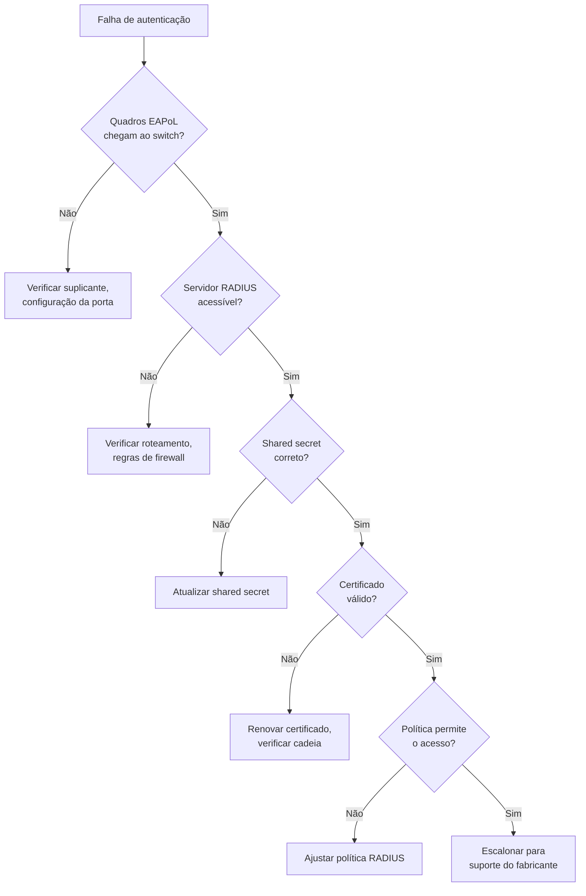

