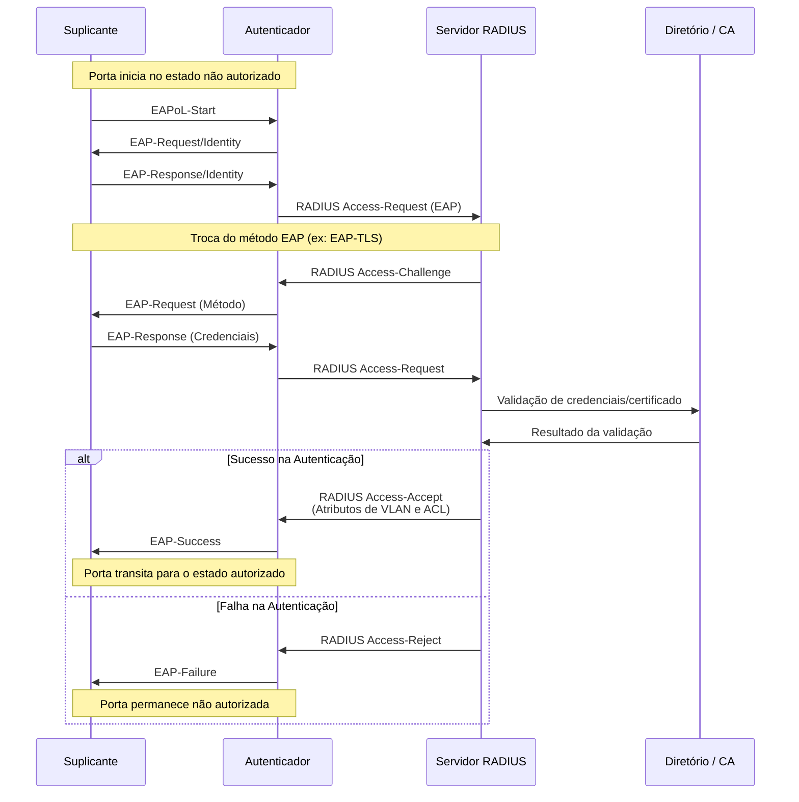
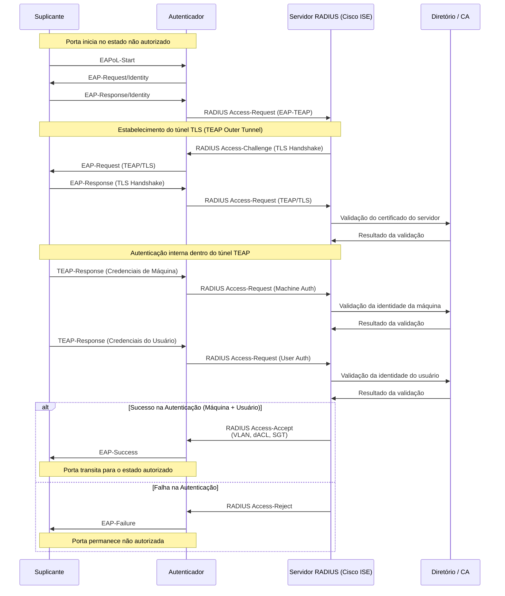
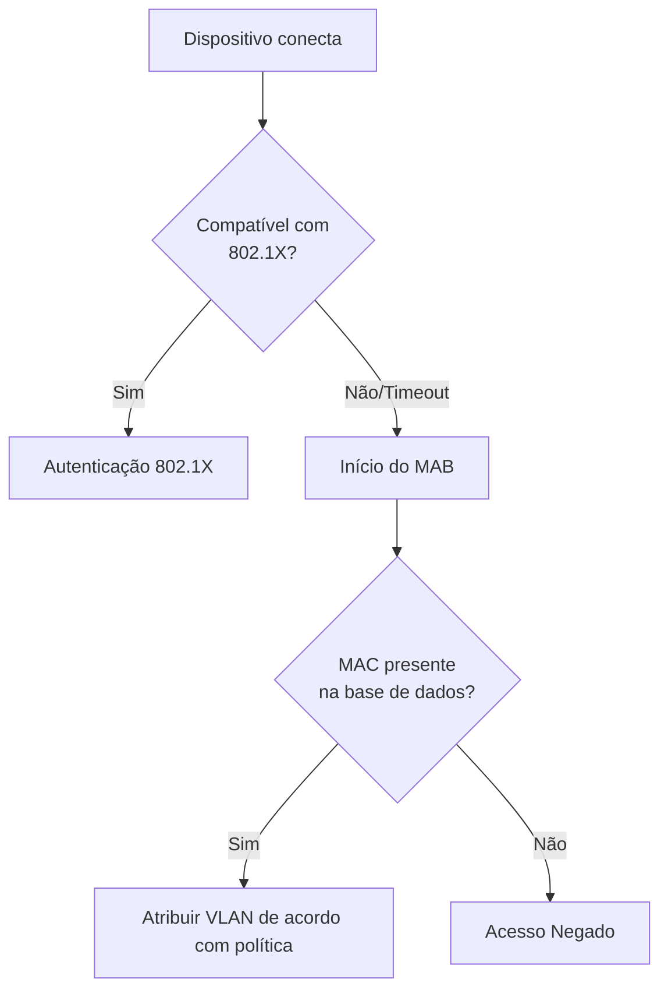
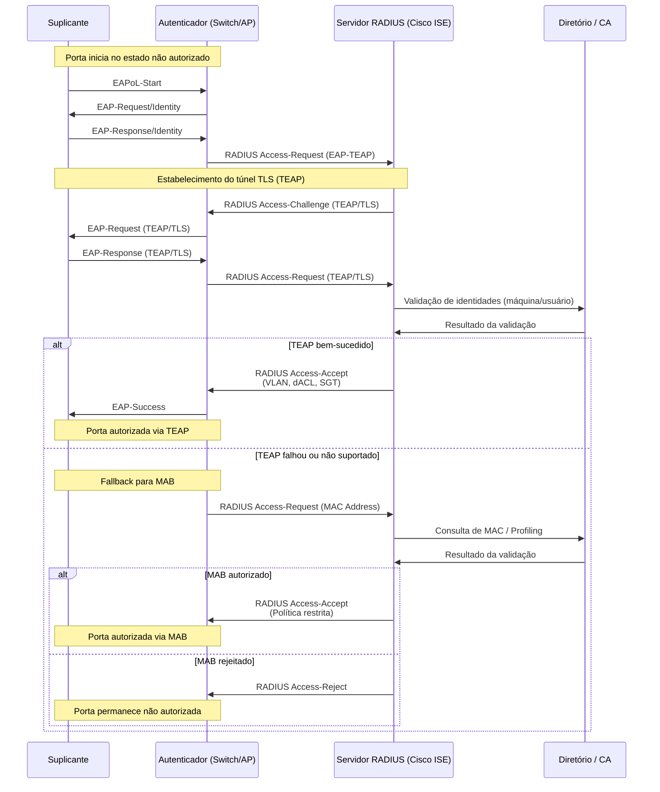

# Tipos de Autenticação

### Autenticação EAP-TLS

### Autenticação EAP-TEAP

### MAC Authentication Bypass (MAB)

### MAB Configuration Requirements

| Parâmetro                      | Configuração Recomendada                                                        | Justificativa Técnica                                                                          |
| ------------------------------ | ------------------------------------------------------------------------------- | ---------------------------------------------------------------------------------------------- |
| Timeout do MAB                 | Iniciar o MAB após o timeout do 802.1X (≈ 30 segundos)                          | Garantir prioridade ao 802.1X, utilizando MAB apenas como mecanismo de fallback                |
| Formato do endereço MAC        | Padronização em minúsculas (lowercase) e com separador (ex.: xx-xx-xx-xx-xx-xx) | Assegurar consistência no cadastro e na correlação de identidades no ISE                       |
| Atributo RADIUS utilizado      | Calling-Station-Id                                                              | Identificar o dispositivo com base no endereço MAC enviado pelo NAD (switch/AP)                |
| Device Profiling               | Habilitado e obrigatório                                                        | Validar o tipo de dispositivo e reduzir o risco de autenticação indevida baseada apenas no MAC |
| Intervalo de re-profiling      | 24 horas                                                                        | Detectar alterações de perfil e possíveis tentativas de spoofing de MAC                        |
| Política para MAC desconhecido | Bloqueio ou quarentena (VLAN restrita / ACL de contenção)                       | Aplicar o princípio de segurança por padrão (default deny)                                     |

### MAB Use Cases

MAB provides network access for devices that cannot perform 802.1X authentication:

| Device Category | Examples | MAB Policy |
|-----------------|----------|------------|
| Network printers | Enterprise print devices | Registered MAC, printer VLAN |
| Building systems | HVAC, access control, elevators | Registered MAC, IoT VLAN |
| Medical devices | Monitors, diagnostic equipment | Registered MAC, restricted VLAN |
| AV equipment | Displays, projectors | Registered MAC, AV VLAN |
| Legacy systems | Older equipment without supplicant | Registered MAC, legacy VLAN |

### Autenticação EAP-TEAP + MAB

