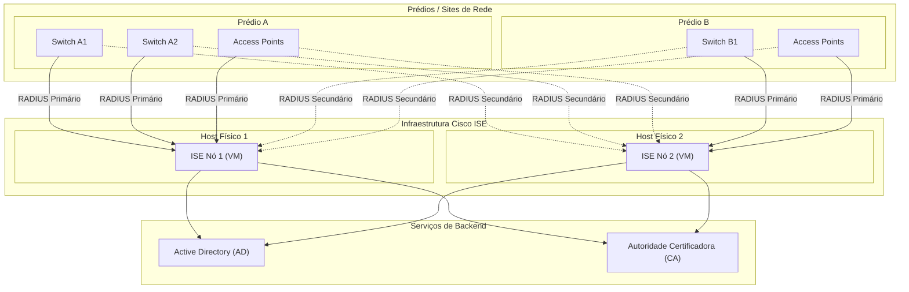

# ISE

### Deployment Redundânte (VM)

### Atributos RADIUS para Aplicação de Políticas

| Attribute | Number | Purpose | Example |
|-----------|--------|---------|---------|
| Tunnel-Type | 64 | VLAN assignment | VLAN |
| Tunnel-Medium-Type | 65 | Medium type | IEEE-802 |
| Tunnel-Private-Group-ID | 81 | VLAN ID/name | 20 |
| Filter-Id | 11 | ACL assignment | CORP-ACL |
| Session-Timeout | 27 | Reauth interval | 28800 (8 hours) |
| Termination-Action | 29 | Post-session action | RADIUS-Request |
